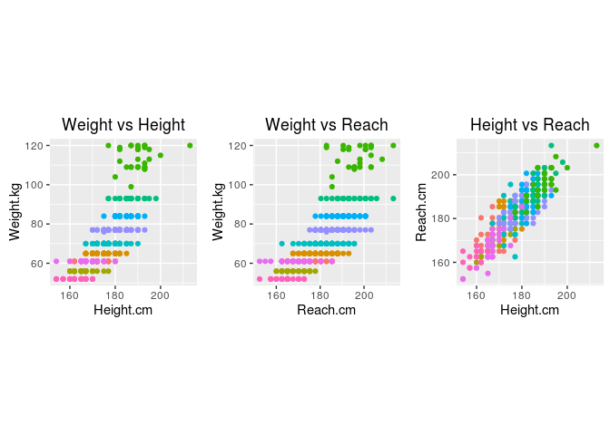
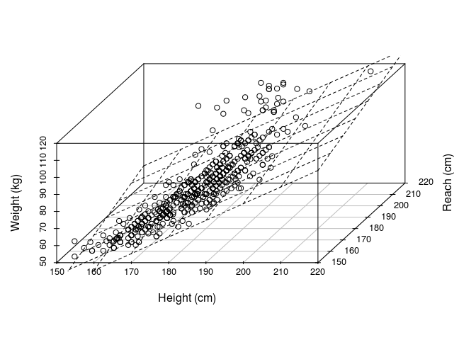

# An Alternative to Weight Classes in MMA
Stephen Zielke  

##Abstract
MMA fighter's are classified based on their weight. Fighters weigh in the day before competition allowing them to cut water weight and fight at smaller weight classes than they weigh during competition. Cutting weight is beleived to have serious long term health implications. I propose an alternative to weight classes based on a fighter's height and reach creating new 'size classes'.

##Introduction
Mixed martial arts, along with most if not all combat sports, relies on a weight class system to ensure fights are fair by occuring only between fighters of similar weight. This weight requirment creates the need to weigh fighters before competition. In preparation many fighters pay strict attention to their weight. Mixed martial arts fighters typiaclly weigh in the day before their fights. This timing of the weigh in allows fighters to loose significant amounts of water weight before being weighed and gain the weight back before fighting.

The weight loss process often involves short term fasting from both food and water coupled with various activities to induce massive amounts of sweating (e.g. saunas, hot baths, and exersize while wearing sweat and rain suits to retain heat). Weight cutting allows a fighter to be larger than the weight class implys confering an advantage through the extra size and strength they are carrying. Too much weight cutting however, can reduce a fighters energy and stamina, and reduce their effectivness in the fight.

There may also be additional longterm health effects with weight cutting. Commentator Joe Rogan has made comments on his excellent podcast, The Joe Rogan Experience, that he wished there was a way to avoid weight cutting in mixed martial arts. Suggestions have included conducting the weigh in immediatly before the fight, thus preventing most weight cutting by making fighters avoid fighting fatigued.

I propose another method of determining classes, not based on weight, but on a fighter's size measured by less variable metrics. Fighter's heights and reach are already measured and in this paper I propose a new 'size class' system based on a these two metrics. A person's height and reach remain relativly constant over ones life, or at least fighting carreer, and thus would only need to be measured once in a fighter's career.

##Data Collection
Fighter weight, height and reach were scraped from ufc.com using the rvest package. The code below accomplishes the data collection:


```r
#global variables
classes <- c("Flyweight","Bantamweight","Featherweight","Lightweight","Welterweight","Middleweight",
               "Light_Heavyweight","Heavyweight","Women_Strawweight","Women_Bantamweight")
fighters <- NULL
fighter.data <- NULL

#collects urls of fighter links
list_urls <- function(){
  root <- c("http://www.ufc.ca/fighter/Weight_Class/")
  pages <- NULL
  for (i in 1:length(classes)){
    u <- paste(root,classes[i],sep="")
    page <- read_html(u)
    links <- html_nodes(page,".step")
    for (j in 1:length(links)){
      temp <- as.character(links[j])
      temp <- sub(".*?/(.*?)asc.*", "\\1", temp)
      temp <- gsub("amp;","",temp)
      temp <- paste(root,temp,"asc",sep="")
      u <- c(u,temp)
    }#for j
    u <- data.frame(Class = classes[i],Links = u)
    pages <- rbind(pages,u)
  }#for i
  pages
}#list_urls

#collects urls of individual fighters
fighter_urls <- function(pages){
  fu <- NULL
  for (i in 1:nrow(pages)){
    p <- read_html(as.character(pages$Links[i]))
    links <- html_nodes(p,".fighter-name")
    for (j in 1:length(links)){
      temp <- as.character(links[j])
      temp <- sub(".*?/(.*?)\".*", "\\1", temp)
      temp <- data.frame(Link=temp,Class=pages$Class[i])
      fu <- rbind(fu,temp)
    }#for j
  }#for i
  fu
}#fighter_urls

#does error checking for collected values
#requires:
#   fighter - name of fighter
#   class - weight class
#   w - weight
#   h - height
#   r - reach
#returns: data frame
check_value <- function(fighter,class,w,h,r){
  if (length(w)==0) {w <- NA}
  if (length(h)==0) {h <- NA}
  if (length(r)==0) {r <- NA}
  data.frame(fighter=fighter,Class=class,Weight.kg=w,Height.cm=h,Reach.cm=r)
}#check_value

#collects info on fighters
#requires: nothing
#returns: nothing
get_data <- function(){
  pages <- list_urls()
  fighters <<- fighter_urls(pages)
  w <- NULL; h <- NULL; r <- NULL; dat <- NULL
  root <- "http://www.ufc.ca/fighter/"
  for (i in 1:nrow(fighters)){
    u <- paste(root,as.character(fighters$Link[i]),sep="")
    p <- read_html(u)
    w <- html_nodes(p,"#fighter-weight")
    w <- as.numeric(sub(".*?[(](.*?)k.*", "\\1", w))
    h <- html_nodes(p,"#fighter-height")
    h <- as.numeric(sub(".*?[(](.*?)c.*", "\\1", h))
    r <- html_nodes(p,"#fighter-reach")
    r <- 2.54*as.numeric(sub(".*?[>](.*?)\".*", "\\1", r))
    temp <- check_value(fighters$Link[i],fighters$Class[i],w,h,r)
    dat <- rbind(dat,temp)
  }#for i
  fighter.data <<- na.omit(dat)
  write.csv(fighter.data,file="data.csv",row.names=FALSE,quote=FALSE)
}#get_data
```

##Creating New Classes

The proposed size classes should be based on static features of a fighters body, and thus I will attempt to create a classification based on a linear combination of a fighter's height and reach. The plots below show the relationship between a fighters height, reach, and weight. Colours signify different weight classes.

 

Most of the fighter's weights are at their weight class weights, and are thus grouped into classes already which is not ideal for creating a linear model. Initially I did attempt to create a fit only on the heavyweight data as their weights show some variability, however the fit was not good over the whole range. The relationship between height or reach to weight is also not linear perfectly, so I attempted a quadratic model, however it did not produce a much better fit, and linear model is very simple. Therefore I fit all the data. The code below produces the linear model and displays the coefficients and shows a plot of the data with the fit.


```r
beta.fit <- lm(Weight.kg ~ Height.cm + Reach.cm,data=fighter.data)
beta.fit
```

```
## 
## Call:
## lm(formula = Weight.kg ~ Height.cm + Reach.cm, data = fighter.data)
## 
## Coefficients:
## (Intercept)    Height.cm     Reach.cm  
##   -162.7468       0.9756       0.3479
```

```r
p3d <- scatterplot3d(x=fighter.data$Height.cm,y=fighter.data$Reach.cm,z=fighter.data$Weight.kg,angle=60,
                     xlab="Height (cm)",ylab="Reach (cm)",zlab="Weight (kg)")
p3d$plane3d(beta.fit)
```

 

The model suggests a form of my linear model to be approximatly $\beta = 0.975*height + 0.35*reach$. $\beta$ here is the value calculated by the fit. Each fighter then recieves a $\beta$ score which will determine their size class. I then apply this model to the data and find the average $\beta$ score of each weight class.


```r
fighter.data <- mutate(fighter.data,beta = (0.975*Height.cm)+(0.35*Reach.cm))
avg <- aggregate(fighter.data[,6],list(fighter.data$Class), mean)
names(avg) <- c("Weight.Class","beta.mean")
avg <- arrange(avg,beta.mean)
pander(avg)
```


------------------------------
   Weight.Class     beta.mean 
------------------ -----------
Women_Strawweight     215.7   

    Flyweight         220.3   

Women_Bantamweight    222.6   

   Bantamweight        226    

  Featherweight       232.7   

   Lightweight        236.3   

   Welterweight       241.6   

   Middleweight       246.8   

Light_Heavyweight      250    

   Heavyweight         254    
------------------------------

Each weight class now has an average $\beta$ score. Starting with the smaller classes I increase the $\beta$ score by five for each larger class. Along with the new definitions, I propose new names for each size class based on Greek mythology as words such as light and heavy no longer apply. These new names also remove the need to have a 'womens' modifier in the name of women's classes.


--------------------------------------------
   Weight.class     Size.Class   Beta.Score 
------------------ ------------ ------------
Women_Strawweight    Artemis        215     

    Flyweight        Dionysus       220     

Women_Bantamweight    Athena        220     

   Bantamweight        Pan          225     

  Featherweight       Hermes        230     

   Lightweight      Hephaestus      235     

   Welterweight        Ares         240     

   Middleweight       Apollo        245     

Light_Heavyweight    Poseidon       250     

   Heavyweight         Zeus         open    
--------------------------------------------

##Conclusion
I would like to mention the class system proposed here is only meant as an example of an alternative to the traditional weight classes. Given sufficient time and resources a fuller and more accurate method for determining a fighters size class could be determined, however a class system based on body features which are as static, such as height and reach, would solve the problem requiring weigh-ins before fights allowing for better health and stamina of fighters; resulting in more entertaining fights (which is what we all want).

Accurate measurments are required for this system to work and would nessesitate some sort of standard mearsuring technique. Trained individuals may negate some discrepancies in measurements as well as specilized apparatuses (midevil torture devices come to mind).

As a final argument for a size based system it is also important to note that weight is not the be all end all of determing equality between fighters of a given class. Jon Jones for instance, in addition his skill, has a huge advantage against his opponents due to his lanky body. Thus weight classes do favor some fighters over others. Also, other sports (hockey, football, rugby...) have a variety of sized players competing directly with each other with little to no compensation for size or speed differences and makes me wonder just how nessesary size classes are.
